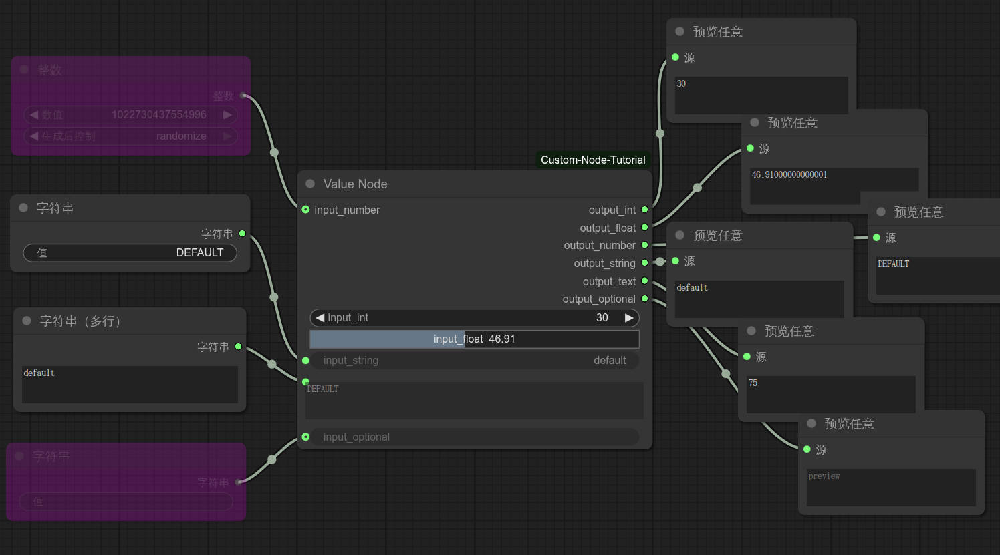
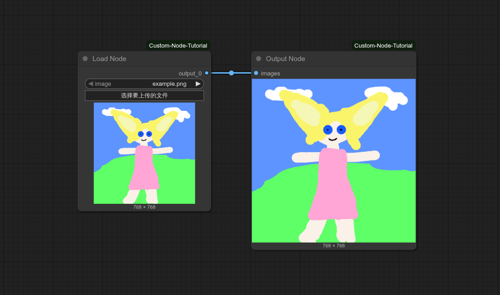
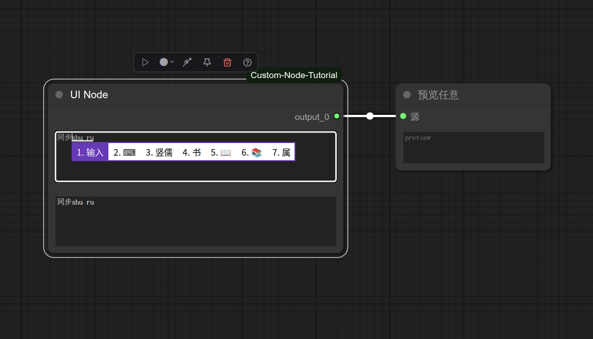
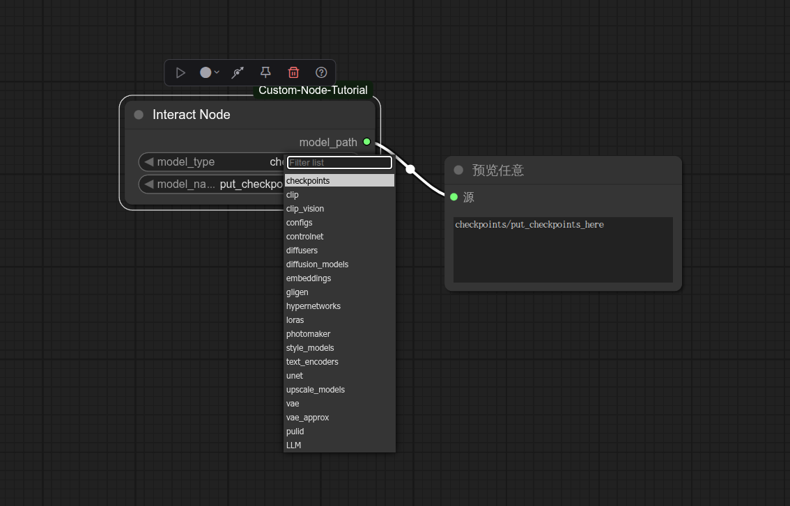
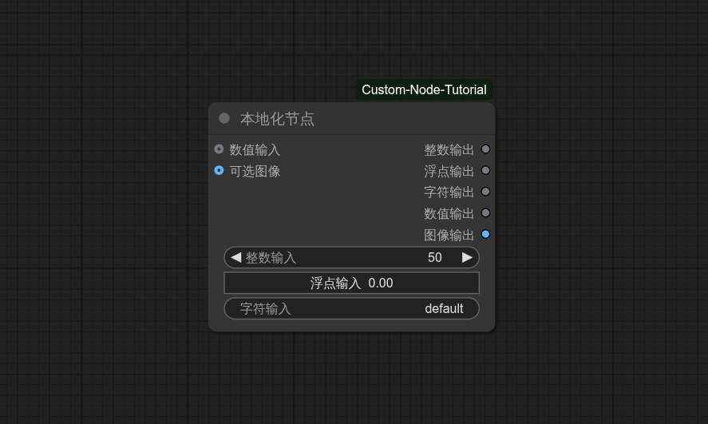

# ComfyUI Custom Node Tutorial

> A development tutorial for customizing nodes for ComfyUI. 

[简体中文](README.md) | English

## Custom Value Node

> Demonstration of the creation and effect of different numerical slots

### Effect

### Code

Python Code: [nodes/value_node.py](nodes/value_node.py)

## Custom Load/Output Node

> Custom load/output node creation and effect demonstration

### Effect

### Code

Python Code: [nodes/load_node.py](nodes/load_node.py)

Python Code: [nodes/output_node.py](nodes/output_node.py)

## Custom UI Node

> Use JavaScript to customize the interaction between the node's front-end UI and components

### Effect

### Code

Python Code: [nodes/ui_node.py](nodes/ui_node.py)

JavaScript Code: [web/ui.js](web/ui.js)

## Custom Interact Node

> Customize nodes for server interaction-related functions

### Effect

### Code

Python Code: [nodes/interact_node.py](nodes/interact_node.py)

JavaScript Code: [web/interact.js](web/interact.js)

## Custom Localized Node

> Node localized via Python code or JS script

### Effect

### Code

Python Code: [nodes/locale_node.py](nodes/locale_node.py)

JavaScript Code: [web/locale.js](web/locale.js)
