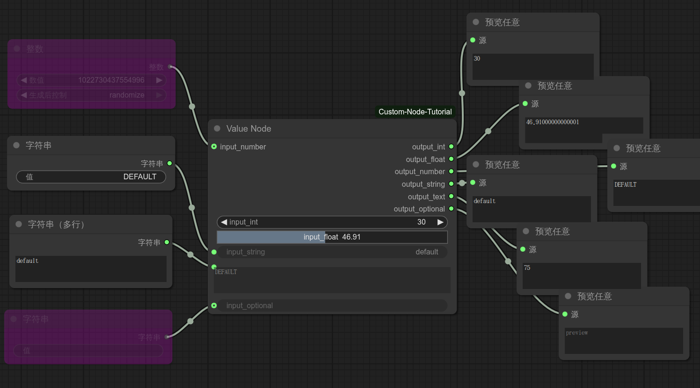
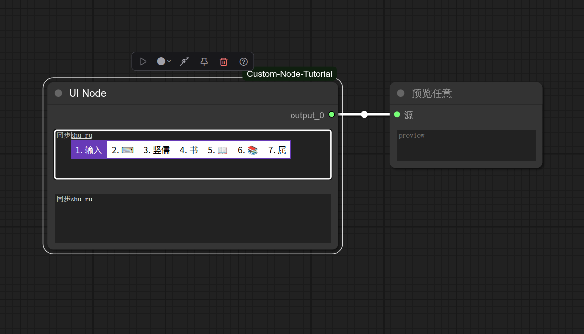
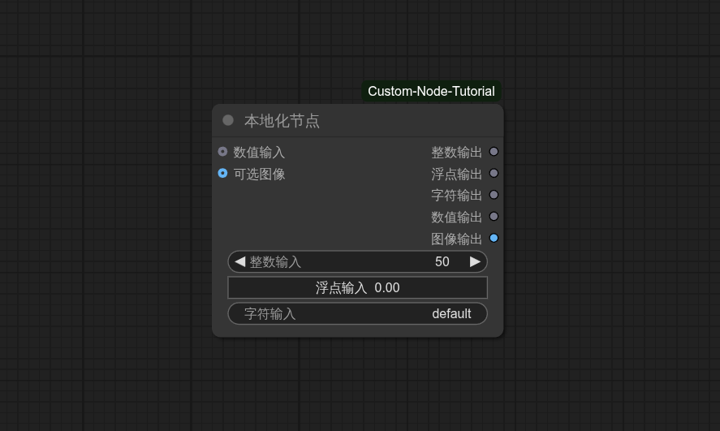

# ComfyUI 自定义节点教程
> ComfyUI 自定义节点的开发教程.

## 自定义数值节点

> 不同数值插槽的创建与效果演示

### 效果演示

### 相关代码

数值节点Python代码：[nodes/value_node.py](nodes/value_node.py)

## 自定义加载/输出节点

> 自定义加载/输出节点的创建与效果演示

### 效果演示

### 相关代码

加载节点Python代码：[nodes/load_node.py](nodes/load_node.py)

输出节点Python代码：[nodes/output_node.py](nodes/output_node.py)

## 自定义UI节点 

> 通过JS脚本自定义节点前端UI与组件交互效果

### 效果演示

### 相关代码

自定义UI节点Python代码：[nodes/ui_node.py](nodes/ui_node.py)

自定义UI节点JavaScript代码：[web/ui.js](web/ui.js)

## 自定义交互节点 

> 自定义服务器交互相关功能的节点

### 效果演示

### 相关代码

自定义交互节点Python代码：[nodes/interact_node.py](nodes/interact_node.py)

自定义交互节点JavaScript脚本：[web/interact.js](web/interact.js)

## 自定义本地化节点 

> 通过Python代码或JS脚本进行节点本地化

### 效果演示

### 相关代码

自定义本地化节点Python代码：[nodes/locale_node.py](nodes/locale_node.py)

自定义本地化节点JavaScript脚本： [web/locale.js](web/locale.js)
